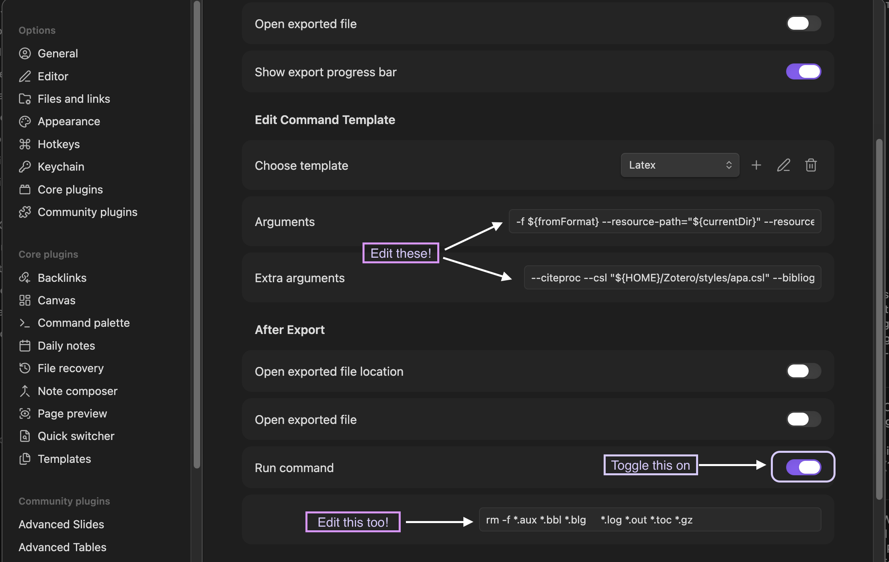
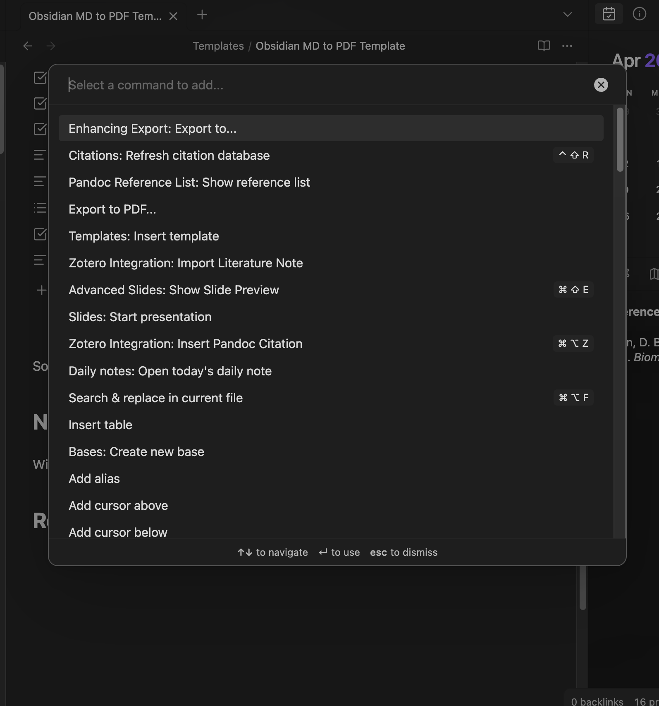
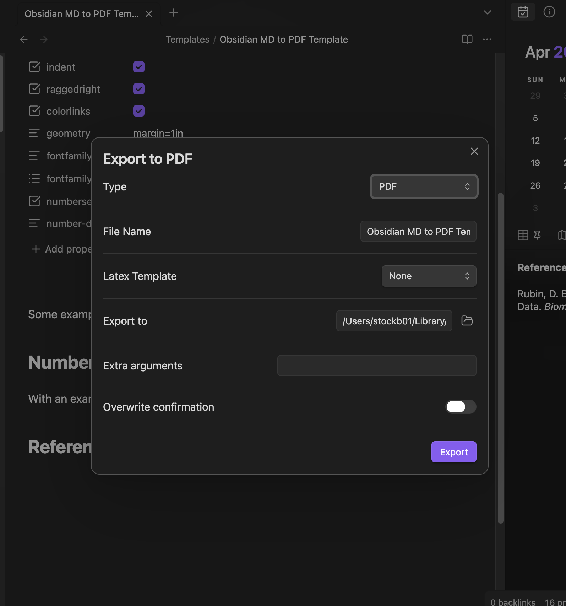

::: {.callout-note}
Note this post is about some workflow issues I've run up against, nothing related to statistics or data science.
:::


Over the course of my dissertation and post-doc, I've used [Obsidian](https://obsidian.md/){target="_blank"} extensively to take notes, organize my thoughts, and keep track of projects. I haven't used it for typesetting documents hardly at all despite using Markdown for job statements, letters, abstracts, and parts of this website.[^1] When I need to share these Markdown files with my advisors or peers, I'd follow this convoluted process because I don't care for Obsidian's heavy-handed automated pdf template:

1. Write a `file.md` file in Obsidian.
2. Find a more minimal `template.tex` file that I like.
3. Open VS Code/[Positron](https://positron.posit.co/){target="_blank"} and write a `bash` script to compile the `.md` file with Pandoc.

```sh
#!/usr/bin/env bash

echo "Compiling the document"
pandoc --template=template.tex --variable "geometry=margin=1in" file.md -o output.pdf
```

4. Check the output and go back to Obsidian to revise `file.md` or fix `template.tex` in VS Code.

That worked ok until I needed to include citations with `natbib` or `biblatex` because then the process became generate a `file.tex` LaTeX file using Pandoc, then compile the pdf from `file.tex` using pdflatex/xelatex: 

```sh
#!/usr/bin/env bash

BASENAME=file
TEX_FILE="${BASENAME}.tex"

echo "Generating .tex"
pandoc --template=template.tex --natbib --bibliography=ref.bib 'file.md' -o "$TEX_FILE"

echo "Compiling pdf"
xelatex -interaction=nonstopmode -halt-on-error "$TEX_FILE" > /dev/null 2>&1
bibtex "$BASENAME" > /dev/null 2>&1
xelatex -interaction=nonstopmode -halt-on-error "$TEX_FILE" > /dev/null 2>&1
xelatex -interaction=nonstopmode -halt-on-error "$TEX_FILE" > /dev/null 2>&1

# Step 3: Clean up auxiliary files
rm -f "$BASENAME".aux "$BASENAME".bbl "$BASENAME".blg \
      "$BASENAME".log "$BASENAME".out "$BASENAME".toc
```

Surely there's a better way to do this within Obsidian...

[^1]: Whenever I have code or code outputs embedded in my documents, I just use Quarto and RStudio/Positron.

## Enhancing Export

Of course there is! The [Enhancing Export](https://github.com/mokeyish/obsidian-enhancing-export){target="_blank"} plug-in does everything I need with some added benefits that streamline the process. There are two requirements that make it all work however:

1. I have CSL files from [Zotero](https://www.zotero.org/){target="_blank"} saved locally.
2. My Zotero library has an auto-updated BibTeX file (`Research.bib`) that I keep in Obsidian.[^2] 

There is some minimal configuration for the plug-in in order to mimic the outputs I get from my VS Code solution.



In the "PDF" template the "Arguments" and "Extra Arguments" need to be set:

**Arguments:** 

```
-f ${fromFormat} 
--resource-path="${currentDir}" 
--resource-path="${attachmentFolderPath}" 
--lua-filter="${luaDir}/pdf.lua" ${ options.textemplate ? `--resource-path="${pluginDir}/textemplate" 
--template="${options.textemplate}"` : ` ` } 
-o "${outputPath}" -t pdf
```

**Extra arguments:** 

```
--pdf-engine=pdflatex 
--citeproc 
--csl "${HOME}/Zotero/styles/apa.csl" 
--bibliography "${HOME}/Path/to/Obsidian/Research.bib"
```

In the "Latex", they are set slightly differently and the "Run command" option need to specified in the "After Export" section.

**Arguments:**

```
-f ${fromFormat} 
--resource-path="${currentDir}" 
--resource-path="${attachmentFolderPath}" ${ options.textemplate ? `--resource-path="${pluginDir}/textemplate" 
--template="${options.textemplate}"` : ` ` } 
--extract-media="${outputDir}" -s 
-o "${outputPath}" -t latex
```


**Extra arguments:** 

```
--citeproc 
--csl "${HOME}/Zotero/styles/apa.csl" 
--bibliography "${HOME}/Path/to/Obsidian/Research.bib"
```

**Run command:** 

```
rm -f *.aux *.bbl *.blg     *.log *.out *.toc *.gz
```

[^2]: [Better BibTeX](https://github.com/retorquere/zotero-better-bibtex){target="_blank"} in Zotero is an incredibly useful extension for keeping reference lists updated while writing and adding new references to Zotero.

## New Workflow

The new workflow is much simpler with the plug-in configured and the YAML for the markdown file set up to work with the TeX template.

1. Press `Cmd+P` and select "Enhancing Export: Export to...".

2. On the export menu, select the output format. Here I've selected pdf and am keeping the note name as the file title.

3. Click "Export".

The key point here is I don't have to write or keep track of a bash script to compile with Pandoc every time I need to export a new pdf from markdown. 

## Example

Here's an example Markdown file to use with the [linked .tex template](template.tex){target="_blank"}.

```md
---
title: Example Note for Documents to Export to PDF
subtitle: A Template
aliases:
  - obsidian-example-template
author:
  - Benjamin Stockton
date: 2026-04-16
tags:
  - workflow
template: Templates/template-essay.tex
linespacing: 1.5
indent: true
raggedright: true
colorlinks: true
geometry: margin=1in
fontfamily: lato
fontfamilyoptions:
  - default
numbersections: true
number-depth: "1"
---

Some example text for what the template looks like.

# Numbered Sections

With an example citation [@rubinInferenceMissingData1976].

# References
```

When exported using the Enhancing Export we get this pdf:

```{=html}
<embed src="example.pdf" width="100%" height="600px" />
```